  

 

# 🏗️ Awesome Construction Field Management

> 🌟 **The definitive curated list of industry-leading SaaS platforms and open-source software for Construction Field Management, Jobsite Productivity, Safety Inspections, Daily Reports, Drawing Viewers, BIM Collaboration, and Crew Time Tracking.**

---

## 📑 Table of Contents

- [🌟 Overview & Ecosystem](#-overview--ecosystem)
- [🏢 SaaS & Commercial Platforms (Ranked by Scale)](#-saas--commercial-platforms-ranked-by-scale)
- [💻 Open-Source Construction & Field Tools (Ranked by Stars)](#-open-source-construction--field-tools-ranked-by-stars)
- [🧰 Categorized Field Capabilities](#-categorized-field-capabilities)
- [🤝 How to Contribute](#-how-to-contribute)
- [📈 Star History](#-star-history)
- [📜 Disclaimer & License](#-disclaimer--license)

---

## 🌟 Overview & Ecosystem

In the Architecture, Engineering, and Construction (AEC) and PropTech industries, **Construction Field Management** software bridges the communication gap between field jobsites (superintendents, foremen, subcontractors, field engineers) and the main office (project managers, estimators, executives). 

Key jobsite operational pillars include:
- 📋 **Daily Logs & Site Diaries**: Weather conditions, work logs, crew attendance, deliveries, and photo documentation.
- 📐 **Plan Viewing & Markups**: Real-time 2D drawing viewing, revision control, sheet hyperlinking, and BIM model inspection.
- ⛑️ **HSE & Safety Inspections**: Digital safety audits, OSHA compliance, incident reporting, and hazard observations.
- ⏱️ **Time Tracking & GPS Dispatch**: Geo-fenced crew clock-in/out, labor cost coding, and equipment tracking.
- 📝 **Quality & Issue Tracking**: Punch lists, RFIs, submittals, and defect management.

---

## 🏢 SaaS & Commercial Platforms (Ranked by Scale)

*The commercial market leaders sorted in descending order by company scale (market valuation / annual revenue).*

| 🏷️ Platform | 💼 Company Scale (Valuation / Revenue) | 🎯 Focus & Core Capabilities | 💰 Starting Pricing | 🎁 Free Tier / Trial Limits |
| :--- | :--- | :--- | :--- | :--- |
| **[Autodesk Build](https://www.autodesk.com/products/autodesk-build/)** *(ACC)* | **~$53.1 Billion** Market Cap / **~$7.5B** Annual Rev *(Public: NASDAQ: ADSK)* | Plan viewing, sheet hyperlinking, issue tracking, RFIs, submittals, daily reports, and full BIM/ACC ecosystem integration. | Starts at **$165/user/month** *(or $1,550/user/year for Build 550 sheet tier; pay-as-you-go Flex tokens at $3/token)* | **30-day free trial** with full access to Build tools and sheet viewer *(no credit card required)*. |
| **[Procore](https://www.procore.com/)** | **~$9.5 Billion** Market Cap / **~$1.5B** Annual Rev *(Public: NYSE: PCOR)* | Comprehensive enterprise construction platform covering daily logs, drawing sheets, observations, punch lists, RFIs, and field coordination. | Starts at **~$375/month** *(approx. $4,500–$10,000/year base tier for <$3M annual volume; includes unlimited users & storage)* | **No free-forever plan** *(0-day self-serve trial; live personalized demo and free subcontractor portal for RFIs/bidding)*. |
| **[Fieldwire](https://www.fieldwire.com/)** *(Hilti)* | **~$300 Million** Acquisition / **~$7.5B** Parent Rev *(Hilti Group)* | Mobile-first jobsite coordination, plan viewing, task management, issue tracking, punch lists, and drawing markup on tablets/phones. | Starts at **$39/user/month** *(Pro tier, billed annually)* or $54/user/month *(billed monthly)* | **Free Forever Basic plan** limited to max 5 users, 3 projects, and 100 plan sheets. |
| **[HammerTech](https://www.hammertech.com/)** | **~$100M+** Est. Valuation / **~$22.9M** Annual Rev *(Private / Riverwood)* | Construction safety (HSE), quality management, subcontractor compliance, daily diaries, and jobsite operational risk reduction. | Starts at **~$500/project/month** *(flat project fee based on annual construction volume; unlimited users, free for subcontractors)* | **No free-forever plan** *(0-day self-serve trial; live guided product demo & unlimited free subcontractor access)*. |
| **[Raken](https://www.rakenapp.com/)** | **~$60M+** Est. Valuation / **~$16.5M** Annual Rev *(Private / Sverica)* | Field-first daily reports, time tracking, production tracking, photo/video documentation, toolbox talks, and contractor workflows. | Starts at **$23/user/month** *(Basic tier, billed annually; 3-user minimum; Performance at ~$59/user/mo)* | **14-day free trial** with full access to daily logs and time tracking *(no credit card required)*. |
| **[BusyBusy](https://www.busybusy.com/)** | **~$50M+** Est. Valuation / **~$15.5M** Annual Rev *(Acquired by ToolWatch)* | GPS time tracking, jobsite crew clock-in/out verification, equipment utilization, labor cost coding, and daily productivity logs. | Starts at **$9.99/user/month** *(Pro tier, billed annually)* or $11.99/mo + $40/month base admin fee | **Free Forever plan** with unlimited users *(core GPS time clock & basic reports)*; **14-day free trial** on Pro/Premium features. |
| **[Safesite](https://www.safesite.co/)** | **~$25M+** Est. Valuation / **~$5.8M** Annual Rev *(Private / Insight Partners)* | Mobile digital safety inspections, safety meetings, OSHA 300 logs, incident reporting, and jobsite safety score analytics. | Starts at **$16/member/month** *(Premium tier, billed annually)* or $20/month *(monthly)* | **Free Forever plan** with unlimited members & guests *(reporting & safety analytics history limited to 30 days; 30-day Premium trial)*. |
| **[Assignar](https://www.assignar.com/)** | **~$25M+** Est. Valuation / **~$5.3M** Annual Rev *(Private / Tiger Global)* | Heavy civil and self-perform workforce scheduling, crew dispatching, equipment allocation, asset maintenance, and field compliance. | Starts at **~$400–$500/month** *(approx. $4,800–$6,000/year base tier + onboarding setup fee)* | **No free-forever plan** *(0-day self-serve trial; interactive sandbox test drive and live demo available on request)*. |
| **[eSUB](https://www.esub.com/)** | **~$20M+** Est. Valuation / **~$5.3M** Annual Rev *(Private / Revolution)* | Cloud construction management built exclusively for trade subcontractors: field daily logs, labor tracking, change orders, and pay apps. | Starts at **~$49/user/month** *(base subcontractor tier, billed annually)* | **No free-forever plan** *(0-day self-serve trial; personalized guided live demo and pilot trial upon sales request)*. |
| **[SiteMax](https://www.sitemaxsystems.com/)** | **~$7.5M CAD** Valuation Cap / **~$5.0M** Annual Rev *(Private / CSE)* | Field-first site management: digital safety forms, quality control checklists, daily progress reports, timekeeping, and subcontractor tracking. | Starts at **$25/user/month** *(Starter tier, billed monthly; $20/user/month billed annually)* | **14-day free trial** with full feature access; free Collaborator tier for view-only subs and external partners. |

---

## 💻 Open-Source Construction & Field Tools (Ranked by Stars)

*Open-source GitHub repositories, self-hostable tools, and developer libraries for construction site management, field reporting, BIM, and inspections — sorted in descending order by GitHub Star count.*

| 📦 Repository & Project | ⭐ GitHub Stars | 🛠️ Tech Stack | 📖 Description & Field Capabilities |
| :--- | :--- | :--- | :--- |
| **[Odoo](https://github.com/odoo/odoo)** |  | Python, JavaScript | Modular open-source ERP with integrated **Project Management**, **Field Service**, **Timesheets**, **Inventory**, and **Equipment Maintenance** suites widely used by contractors for site operations. |
| **[ERPNext](https://github.com/frappe/erpnext)** |  | Python, Frappe Framework, JS | Comprehensive open-source ERP with native **Projects**, **Material Requests**, **Subcontracting**, and **Job Costing** modules easily extensible for jobsite daily logs and field dispatch. |
| **[FreeCAD](https://github.com/FreeCAD/FreeCAD)** |  | C++, Python, Qt | Open-source parametric 3D modeler with dedicated **BIM and Architecture Workbenches** for reading, editing, and generating IFC plans on site. |
| **[OpenProject](https://github.com/opf/openproject)** |  | Ruby on Rails, Angular | Powerful open-source project management platform featuring **BIM 3D model viewing**, **BCF issue management**, **Gantt scheduling**, and task tracking tailored for construction workflows. |
| **[IfcOpenShell](https://github.com/IfcOpenShell/IfcOpenShell)** |  | C++, Python | Open-source IFC toolkit, geometry engine, and authoring library (powers the Bonsai BIM add-on) for reading and manipulating open standard BIM models in the field. |
| **[web-ifc-viewer (IFC.js)](https://github.com/IFCjs/web-ifc-viewer)** |  | TypeScript, Three.js, WebAssembly | Lightweight, fast client-side 3D BIM model and 2D drawing viewer designed for mobile web browsers and custom construction site web applications. |
| **[xeokit-sdk](https://github.com/xeokit/xeokit-sdk)** |  | JavaScript, WebGL | High-performance open-source 3D WebGL SDK for viewing large-scale architectural and engineering BIM models, laser point clouds, and 2D CAD site plans. |
| **[ODK Collect](https://github.com/getodk/collect)** |  | Java, Android | Powerful open-source Android mobile data collection tool for offline safety audits, site inspection forms, GPS tagging, and field photo capture. |
| **[OpenConstructionERP](https://github.com/datadrivenconstruction/OpenConstructionERP)** |  | Python, Flask, HTML/JS | Open-source construction ERP covering Bill of Quantities (BOQ), CAD/BIM takeoffs, cost estimation databases, 4D/5D schedules, site diaries, HSE, and punch lists. |
| **[xeokit-bim-viewer](https://github.com/xeokit/xeokit-bim-viewer)** |  | JavaScript, WebGL | Ready-to-use open-source web application for inspecting 3D BIM models, 2D floorplans, BCF viewpoints, and metadata on jobsites. |
| **[BIMsurfer](https://github.com/opensourceBIM/BIMsurfer)** |  | JavaScript, WebGL | WebGL-based viewer for BIM models (IFC format) providing interactive 3D inspection and site coordination in modern browsers. |
| **[DDC AI Construction Skills](https://github.com/datadrivenconstruction/DDC_Skills_for_AI_Agents_in_Construction)** |  | Python, Markdown | 200+ open-source AI skills and agent prompts for construction automation: BIM data extraction, cost estimation, schedule analysis, and field document control. |
| **[OCA Field Service](https://github.com/OCA/field-service)** |  | Python, JavaScript | Community open-source field service management and crew dispatching suite for Odoo: recurring work orders, GPS tracking, and mobile execution. |
| **[KoBoCAT / KoBoToolbox](https://github.com/kobotoolbox/kobocat)** |  | Python, Django | Open-source mobile form backend and survey engine widely adapted for field hazard inspections, environmental reporting, and quality checklists. |
| **[FieldOpt](https://github.com/zblauser/fieldopt)** |  | TypeScript, React, Node.js | Open-source web platform for job organization, technician assignment, skill-based crew matching, and field work order tracking. |
| **[FlexDesk](https://github.com/Paulo-BatistaFerraz/flexdesk)** |  | TypeScript, Next.js, TailwindCSS | Open-source field service management app featuring job scheduling, technician assignment, offline support, and GPS location tracking. |
| **[SiteWise](https://github.com/Site-Wise/app)** |  | Flutter, Dart | Mobile-first, self-hostable construction site app for tracking materials, labor, expenses, subcontractor bills, and multi-site progress with offline sync. |
| **[Construbot](https://github.com/javier-llamas/construbot)** |  | PHP, Laravel, MySQL | Open-source construction management system focused on contracts, milestones, estimates, progress billing, and financial job costing. |

---

## 🧰 Categorized Field Capabilities

### 📋 1. Daily Reports & Site Diaries
- **SaaS**: [Raken](https://www.rakenapp.com/), [Fieldwire](https://www.fieldwire.com/), [Procore](https://www.procore.com/), [SiteMax](https://www.sitemaxsystems.com/)
- **Open-Source**: [SiteWise](https://github.com/Site-Wise/app), [OpenConstructionERP](https://github.com/datadrivenconstruction/OpenConstructionERP)

### 📐 2. Plan Viewing, Markups & BIM Coordination
- **SaaS**: [Autodesk Build](https://www.autodesk.com/products/autodesk-build/), [Fieldwire](https://www.fieldwire.com/), [Procore](https://www.procore.com/)
- **Open-Source**: [FreeCAD](https://github.com/FreeCAD/FreeCAD), [OpenProject BIM](https://github.com/opf/openproject), [xeokit-bim-viewer](https://github.com/xeokit/xeokit-bim-viewer), [IFC.js web-ifc-viewer](https://github.com/IFCjs/web-ifc-viewer), [IfcOpenShell](https://github.com/IfcOpenShell/IfcOpenShell)

### ⛑️ 3. Safety, HSE & Quality Inspections
- **SaaS**: [Safesite](https://www.safesite.co/), [HammerTech](https://www.hammertech.com/), [SiteMax](https://www.sitemaxsystems.com/)
- **Open-Source**: [ODK Collect](https://github.com/getodk/collect), [KoBoToolbox](https://github.com/kobotoolbox/kobocat)

### ⏱️ 4. Crew Scheduling, Time Tracking & Labor Dispatch
- **SaaS**: [BusyBusy](https://www.busybusy.com/), [Assignar](https://www.assignar.com/), [Raken](https://www.rakenapp.com/)
- **Open-Source**: [Odoo Field Service](https://github.com/odoo/odoo), [OCA Field Service](https://github.com/OCA/field-service), [FlexDesk](https://github.com/Paulo-BatistaFerraz/flexdesk), [FieldOpt](https://github.com/zblauser/fieldopt)

### 🔨 5. Subcontractor & Specialty Trade Management
- **SaaS**: [eSUB](https://www.esub.com/), [Assignar](https://www.assignar.com/)
- **Open-Source**: [ERPNext](https://github.com/frappe/erpnext), [Construbot](https://github.com/javier-llamas/construbot)

---

## 📈 Star History

---

## 🤝 How to Contribute

Contributions are warmly welcomed! Help keep this repository the top resource for construction technologists and field teams:

1. 🍴 **Fork the repository**.
2. 🌿 **Create a feature branch**: `git checkout -b add-tool-name`.
3. 📝 **Add your tool**:
   - For **SaaS**: include official URL, starting pricing tier, free tier / trial limits, and company scale.
   - For **Open-Source**: include GitHub repo URL, star badge ``, tech stack, and description.
4. 📬 **Submit a Pull Request** with a brief summary of the addition.

---

## 📜 Disclaimer & License

- 🛡️ This list is curated for informational and educational purposes. Mentions do not imply commercial endorsement.
- ⚖️ Construction field operations involve safety-critical protocols, regulatory certifications (OSHA/HSE), and contractual records. Always verify compliance with local laws.
- 📄 Distributed under the [MIT License](LICENSE).

---

Built with ❤️ for Superintendents, Field Engineers, Foremen, and Construction Tech Innovators.

